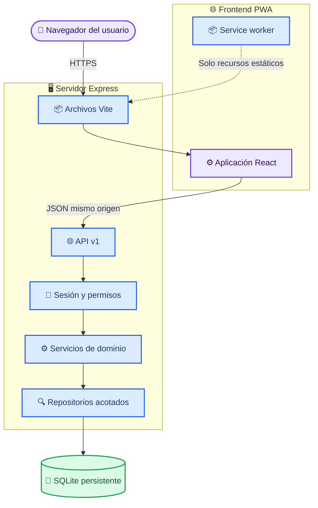

# Arquitectura de Savia

_Contrato técnico para Savia: React/Vite PWA, API Express y SQLite bajo un mismo origen._

---

## 📋 Alcance

La aplicación administra un invernadero por cuenta, sus cultivos, sensores y registros históricos. El diseño prioriza los requisitos evaluables: separación de responsabilidades, API propia, persistencia, autenticación, autorización por propietario, experiencia responsiva, PWA y despliegue reproducible.

La arquitectura es un monorepo con dos aplicaciones:

- `apps/web`: interfaz React compilada por Vite
- `apps/api`: servidor Express, lógica de negocio y acceso a SQLite

En producción, un único servidor Express publica tanto los archivos estáticos del frontend como `/api/v1`. Esto conserva el mismo origen para la PWA, la API y la cookie de sesión.

## 🏗️ Vista general



### Responsabilidades por capa

| Capa | Responsabilidad | No debe hacer |
| --- | --- | --- |
| **React** | Presentar datos, validar formularios para UX y manejar estados | Decidir permisos o confiar en IDs del usuario |
| **Rutas/controladores** | Interpretar HTTP, validar entrada y formar respuestas | Contener consultas SQL o reglas complejas |
| **Servicios** | Ejecutar casos de uso y reglas de negocio | Leer directamente la cookie o renderizar vistas |
| **Repositorios** | Ejecutar SQL parametrizado y aplicar alcance por propietario | Exponer registros de otros usuarios |
| **SQLite** | Persistir datos, claves foráneas, unicidad y cascadas | Reemplazar validaciones de dominio comprensibles |

## 🔄 Flujo de una solicitud

1. El navegador envía una solicitud a `/api/v1` con la cookie `HttpOnly` de sesión.
2. Express rechaza cuerpos inválidos, orígenes no permitidos y sesiones ausentes o vencidas.
3. El middleware carga la identidad mínima: `userId`, `role` y vencimiento.
4. El servicio valida la operación y solicita datos a un repositorio.
5. El repositorio consulta por ID junto con el propietario autenticado; un ID ajeno no concede acceso.
6. La API responde con JSON estable o un error público sin detalles internos.

Para recursos de usuario, la autorización forma parte de la consulta. Un cultivo no se busca solo por `crop.id`; se relaciona con `greenhouses.user_id = session.userId`. Así se evita que cambiar un ID en la URL permita consultar o modificar datos ajenos.

## 🔐 Autenticación y autorización

### Sesiones opacas

- El inicio de sesión compara la contraseña con un hash adaptativo almacenado.
- La API genera un identificador aleatorio de alta entropía sin datos personales ni permisos codificados.
- El navegador recibe el identificador en una cookie `HttpOnly`, `SameSite=Lax`, `Path=/` y `Secure` en producción.
- La base guarda únicamente el hash del identificador, el usuario y su vencimiento.
- El cierre de sesión elimina la sesión del servidor y expira la cookie.
- Las sesiones vencidas se rechazan y se eliminan mediante limpieza periódica o durante el acceso.

La aplicación no usa `localStorage` para credenciales. Las respuestas de autenticación y `/api/v1` se marcan como privadas o no almacenables y nunca entran en la caché del service worker.

### Reglas de acceso

| Operación | Regla aplicada en API |
| --- | --- |
| Recurso propio | Requiere sesión y unión con el invernadero del usuario |
| Crear cultivo o sensor | La API obtiene el invernadero desde la sesión; ignora cualquier propietario enviado |
| Consultar registros | Verifica primero que el sensor pertenezca al usuario |
| Ruta administrativa | Requiere sesión y `role = ADMIN` |
| Eliminar una cuenta | Requiere administrador, transacción y cascadas declaradas |

Un recurso ajeno responde como no encontrado cuando revelar su existencia facilitaría enumeración. Una operación válida pero no autorizada por rol responde `403`.

## 🌐 Contrato HTTP

Todos los endpoints funcionales viven bajo `/api/v1`.

| Convención | Decisión |
| --- | --- |
| Formato | JSON UTF-8, salvo archivos estáticos |
| Fechas | ISO 8601 en UTC |
| IDs | UUID válidos generados por el servidor |
| Creación | `201 Created` con el recurso creado |
| Actualización | `200 OK` con el recurso actualizado |
| Eliminación | `204 No Content` |
| Validación | `400` o `422` con errores por campo |
| Sesión ausente | `401 Unauthorized` |
| Rol insuficiente | `403 Forbidden` |
| Recurso inexistente o ajeno | `404 Not Found` |

### Error público

```json
{
  "error": {
    "code": "VALIDATION_ERROR",
    "message": "Revisa los datos ingresados.",
    "fields": {
      "name": "El nombre es obligatorio."
    },
    "requestId": "req_..."
  }
}
```

Los mensajes no incluyen SQL, rutas del servidor, trazas, secretos ni contenido de la cookie. El detalle técnico se registra en el servidor junto con `requestId`.

## 📦 PWA y comportamiento de caché

El manifest declara nombre, colores, iconos y modo `standalone`. El service worker sigue estas reglas:

- Precaché de HTML de entrada, JavaScript, CSS, fuentes e iconos con revisión por hash
- Estrategia `CacheFirst` para recursos estáticos versionados
- Estrategia `NetworkFirst` para navegación, con una pantalla de indisponibilidad controlada
- Estrategia `NetworkOnly` para `/api/v1/**`, autenticación y mutaciones
- Limpieza de cachés antiguas durante la activación
- Aviso visible cuando existe una nueva versión antes de recargar

La instalación PWA no promete edición sin conexión. Si no hay red, los formularios no simulan éxito y explican que la operación debe reintentarse.

## ⚙️ Decisiones principales

| Decisión | Elección | Motivo y consecuencia |
| --- | --- | --- |
| Repositorio | npm workspaces | Un solo flujo de instalación, pruebas y build para web y API |
| Frontend | React + Vite | Interfaz por componentes y compilación PWA optimizada |
| Backend | Express en `/api/v1` | API propia, explícita y fácil de probar por integración |
| Persistencia | SQLite con migraciones | Operación simple para un proyecto académico; requiere volumen persistente y una instancia escritora |
| Sesión | Token opaco en cookie | Revocación inmediata y ausencia de datos sensibles en el navegador |
| Despliegue | Frontend y API en Express | Mismo origen, cookie simple y ausencia de CORS en producción |
| Multiusuario | Alcance en repositorios | El aislamiento no depende del frontend ni de filtros opcionales |
| Gráficos | Datos históricos desde API | El frontend solo representa valores autorizados y filtrados por período |
| Resúmenes | Consultas agregadas en backend | Totales reproducibles sin descargar todas las filas al navegador |
| PWA | Caché de app shell, no de API | Evita mostrar datos privados obsoletos o cruzados entre sesiones |

## 📚 Estructura objetivo

```text
apps/
├── api/
│   ├── src/
│   │   ├── config/
│   │   ├── db/
│   │   ├── middleware/
│   │   ├── repositories/
│   │   ├── routes/
│   │   ├── services/
│   │   └── validation/
│   └── tests/
└── web/
    ├── public/
    ├── src/
    │   ├── components/
    │   ├── features/
    │   ├── pages/
    │   ├── services/
    │   └── styles/
    └── tests/
docs/
```

Los controladores deben ser delgados; las reglas se prueban en servicios y las garantías de propiedad se prueban contra repositorios y endpoints reales.

## ✅ Criterios de calidad

- Toda entrada externa se valida nuevamente en la API
- Toda consulta de usuario demuestra alcance por propietario
- Toda consulta SQL usa parámetros, nunca concatenación de entrada
- Las escrituras relacionadas usan transacciones
- Las claves foráneas se activan en cada conexión a SQLite
- Los gráficos manejan estados sin datos, carga y error
- El frontend funciona con teclado y en anchos móviles
- El build falla ante errores de tipos, lint o pruebas
- La documentación de la rúbrica enlaza cada requisito con una evidencia verificable
