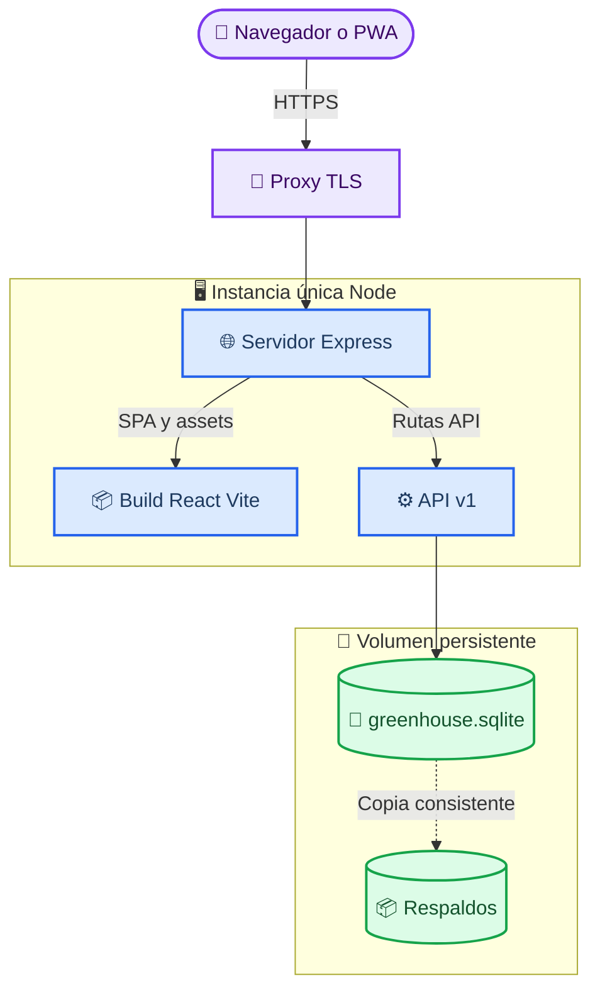

# Despliegue de Savia

_Contrato de producción para servir la PWA y la API bajo un mismo origen con SQLite persistente._

---

## 📋 Resultado esperado

Producción expone una sola URL HTTPS, por ejemplo `https://savia.example.edu`:

- `GET /` y las rutas de React sirven el build de `apps/web`
- `/api/v1/**` llega a la API Express
- La cookie de sesión pertenece al mismo origen y no necesita CORS
- SQLite vive en un volumen persistente, fuera de la imagen y del directorio temporal
- Una única instancia de aplicación realiza escrituras sobre ese archivo

No se despliega el frontend en un dominio y la API en otro. En desarrollo, Vite puede usar un proxy local hacia Express, pero el contrato de producción siempre es mismo origen.

## 🏗️ Topología



## 📦 Contrato del artefacto

La imagen o servicio de producción debe:

1. Instalar dependencias con el archivo de bloqueo mediante `npm ci`.
2. Ejecutar tipos, lint, pruebas y build antes de publicar.
3. Incluir el build estático generado por Vite en una ruta conocida por Express.
4. Montar el volumen antes de inicializar la base.
5. Ejecutar migraciones o inicialización idempotente.
6. Iniciar solo la API Express, que también sirve la SPA.

Flujo de referencia:

```bash
npm ci
npm run check
npm run build

npm run db:migrate --workspace apps/api
npm start
```

La migración debe ser idempotente: no borra datos ni ejecuta un seed de demostración sobre una base existente. El seed es un paso separado y explícito.

### Enrutamiento de Express

El orden de rutas evita que la SPA oculte errores de API:

1. Seguridad, identificador de solicitud y límites de cuerpo
2. `GET /api/v1/health`
3. Rutas `/api/v1/**`
4. Archivos estáticos con hash
5. Fallback `index.html` solo para solicitudes HTML fuera de `/api`
6. Manejador de error público

Una ruta desconocida bajo `/api/v1` devuelve JSON `404`; nunca devuelve `index.html`. Una ruta profunda como `/app/sensores/12/historial` sí entrega la SPA al recargar.

## ⚙️ Variables de entorno

| Variable | Producción | Propósito |
| --- | --- | --- |
| `NODE_ENV` | `production` | Activa cookies seguras y errores públicos |
| `PORT` | Asignado por plataforma | Puerto HTTP interno de Express |
| `DATABASE_PATH` | Ruta dentro del volumen | Archivo SQLite persistente, por ejemplo `/var/lib/savia/greenhouse.sqlite` |
| `APP_ORIGIN` | URL HTTPS exacta | Origen permitido para solicitudes con estado |
| `SESSION_COOKIE_NAME` | Nombre estable | Nombre de la cookie opaca |
| `SESSION_TTL_DAYS` | Entero positivo | Duración máxima de la sesión |
| `TRUST_PROXY` | `true` solo detrás del proxy confiable | Permite reconocer HTTPS y la IP original |
| `AUTO_SEED` | `false` | Controla el seed automático; debe quedar desactivado normalmente |
| `ALLOW_DEMO_SEED` | `false` | Habilita de forma explícita datos académicos de demostración |
| `ADMIN_EMAIL` | Secreto de bootstrap | Correo administrativo inicial |
| `ADMIN_PASSWORD` | Secreto fuerte de bootstrap | Contraseña usada solo durante un seed autorizado |
| `DEMO_USER_PASSWORD` | Solo ambiente de demostración | Contraseña del usuario seed; no configurar en producción real |
| `VITE_API_BASE_URL` | `/api/v1` | Base relativa incorporada durante el build web |

Las variables se documentan en `.env.example`, pero los valores reales se administran en el gestor de secretos de la plataforma. `.env` no se versiona.

> ⚠️ **Advertencia:** Las credenciales académicas de demostración no son válidas para producción. La contraseña administrativa debe cambiarse antes de publicar y no debe aparecer en logs, capturas, historial de shell ni artefactos del frontend.

## 💾 Volumen SQLite

### Montaje

El directorio padre de `DATABASE_PATH` se monta como volumen de lectura y escritura. Un contrato recomendado es:

```text
DATABASE_PATH=/var/lib/savia/greenhouse.sqlite
volumen -> /var/lib/savia
```

El proceso Node necesita permiso para crear el archivo inicial, `greenhouse.sqlite-wal` y `greenhouse.sqlite-shm`. El volumen no se monta sobre el directorio completo de la aplicación porque ocultaría archivos del build.

### Limitaciones de escala

SQLite es adecuado mientras exista una sola instancia escritora. No se debe:

- Guardar la base en el sistema de archivos efímero de un contenedor o función
- Montar el mismo archivo SQLite por red en varias réplicas activas
- Habilitar autoescalado horizontal sin migrar la persistencia
- Copiar solo el archivo principal mientras hay escrituras WAL activas

Si el proyecto necesita varias réplicas, alta disponibilidad o muchas escrituras simultáneas, debe migrarse a una base cliente-servidor antes de escalar. Ese cambio queda fuera del alcance académico mínimo.

### Respaldos y restauración

Un respaldo válido debe ser consistente con WAL. La opción preferida es la API de backup de SQLite o una ventana controlada:

1. Detener nuevas escrituras.
2. Ejecutar un checkpoint de WAL.
3. Crear una copia versionada en otro almacenamiento.
4. Verificar que la copia abre y pasa `PRAGMA integrity_check`.
5. Reanudar el servicio.

Para restaurar, detener la aplicación, conservar una copia del estado actual, reemplazar el archivo desde un respaldo verificado y ejecutar las migraciones compatibles antes de iniciar. Nunca restaurar sobre un proceso escribiendo.

## 🔐 HTTPS, proxy y cookies

- El proxy termina TLS y redirige HTTP a HTTPS.
- Express debe confiar solo en el proxy conocido para interpretar el protocolo original.
- En producción, la cookie usa `Secure`, `HttpOnly`, `SameSite=Lax` y `Path=/`.
- `APP_ORIGIN` debe coincidir exactamente con el origen público, sin comodines.
- Las operaciones con estado comprueban sesión y encabezado `Origin`.
- Las respuestas privadas y de autenticación usan `Cache-Control: no-store`.
- Los logs omiten cookies, contraseñas, cuerpos de login y hashes.

Al mantener web y API en el mismo origen no se habilita CORS de forma general. Si una plataforma agrega otro dominio de vista previa, se configura explícitamente en un ambiente separado; no se usa `*` con credenciales.

## 📱 Publicación de la PWA

| Recurso | Caché recomendada |
| --- | --- |
| `index.html` | Revalidar o vida corta |
| Assets con hash | Pública, inmutable y vida larga |
| `manifest.webmanifest` | Vida corta y revalidación |
| Service worker | Sin caché HTTP prolongada |
| `/api/v1/**` | `no-store`; `NetworkOnly` en service worker |

El despliegue conserva nombres de assets con hash y activa una nueva versión del service worker. La interfaz avisa cuando hay una actualización lista; no fuerza una recarga mientras el usuario completa un formulario.

## 🔍 Salud y observabilidad

`GET /api/v1/health` debe entregar un resultado pequeño y no autenticado:

```json
{
  "status": "ok"
}
```

La comprobación de preparación puede probar una consulta SQLite trivial, pero no expone la ruta de la base, conteos ni versión interna. Los logs estructurados incluyen fecha, nivel, método, ruta, estado, duración y `requestId`.

Alertas mínimas:

- Reinicios repetidos del proceso
- Respuestas `5xx`
- Volumen cercano a capacidad
- Fallo de backup o integridad
- Aumento anormal de intentos de login fallidos

## ✅ Verificación posterior

```bash
curl --fail --silent --show-error https://savia.example.edu/api/v1/health
curl --fail --silent --show-error https://savia.example.edu/manifest.webmanifest
curl --head https://savia.example.edu/app/resumen
```

Además de esos smoke tests:

1. Confirmar certificado HTTPS y cookie `Secure`/`HttpOnly`.
2. Iniciar sesión y ejecutar un CRUD completo.
3. Filtrar cultivos y registros por período.
4. Recargar una ruta profunda de React.
5. Reiniciar la instancia y comprobar que datos y sesiones válidas permanecen.
6. Verificar instalación PWA y actualización del service worker.
7. Confirmar que un usuario normal recibe `403` en `/api/v1/admin/stats`.
8. Confirmar que `/api/v1/**` no aparece en Cache Storage.

## 🔄 Rollback

El artefacto de aplicación y la base se administran por separado. Volver al artefacto anterior es seguro solo si sus consultas comprenden el esquema vigente. Las migraciones destructivas requieren una fase compatible y un respaldo previo.

Un rollback no consiste en reemplazar automáticamente la base por una copia antigua: eso perdería datos válidos creados después del despliegue. La restauración de base se reserva para corrupción o migración fallida confirmada y se documenta como incidente.
