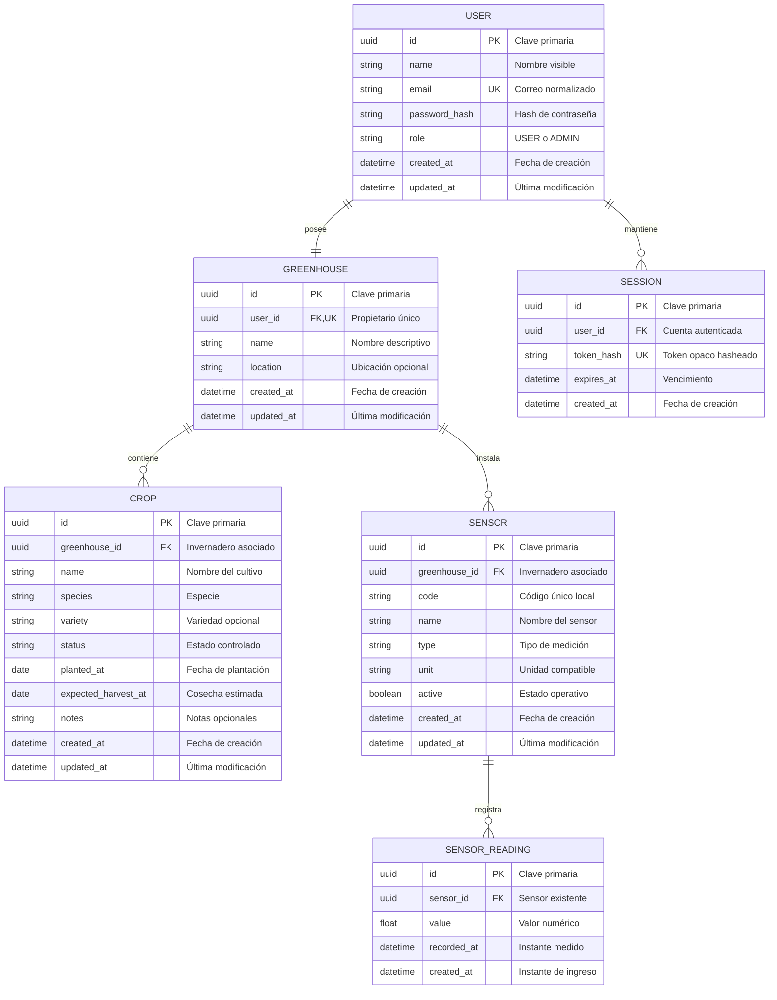

# Modelo de datos

_Diseño relacional de Savia para SQLite, incluyendo propiedad, sesiones y datos históricos._

---

## 📋 Principios del modelo

El modelo representa seis entidades. Las claves foráneas y restricciones protegen relaciones estructurales; los servicios de la API aplican reglas que necesitan mensajes de error comprensibles o identidad autenticada.

- Cada cuenta posee exactamente un invernadero
- Cada cultivo y sensor pertenece a un invernadero
- Cada lectura pertenece a un sensor existente
- Cada sesión opaca pertenece a una cuenta y puede revocarse
- La propiedad se determina por relaciones, nunca por un `userId` enviado por el navegador
- Las fechas se guardan en UTC con formato ISO 8601

## 💾 Diagrama entidad-relación



## 🔗 Relaciones y cascadas

| Relación | Restricción | Al eliminar el padre |
| --- | --- | --- |
| `USER → GREENHOUSE` | `greenhouses.user_id NOT NULL UNIQUE` | `CASCADE` elimina el invernadero y su árbol de recursos |
| `USER → SESSION` | `sessions.user_id NOT NULL` | `CASCADE` revoca todas las sesiones |
| `GREENHOUSE → CROP` | `crops.greenhouse_id NOT NULL` | `CASCADE` elimina los cultivos |
| `GREENHOUSE → SENSOR` | `sensors.greenhouse_id NOT NULL` | `CASCADE` elimina los sensores |
| `SENSOR → SENSOR_READING` | `sensor_readings.sensor_id NOT NULL` | `CASCADE` elimina el historial del sensor |

La eliminación de una cuenta administrativa debe ejecutarse en una transacción. Las cascadas hacen que no queden registros huérfanos, pero la API debe confirmar el objetivo, impedir la autoeliminación accidental del administrador activo y devolver éxito solo después del `COMMIT`.

La eliminación de un sensor también borra su historial. La interfaz debe advertir esta consecuencia antes de confirmar; no se implementa borrado suave en el alcance mínimo.

## 🔐 Restricciones y reglas

### Cuentas e invernaderos

- `email` se normaliza con espacios recortados y minúsculas antes de comprobar unicidad
- `password_hash` nunca se selecciona en respuestas públicas
- `role` acepta solo `USER` o `ADMIN`
- La creación de cuenta y su invernadero ocurre en una misma transacción
- `user_id` no se puede cambiar mediante una operación de edición
- El repositorio obtiene el invernadero desde `session.userId`

### Cultivos

- `name`, `species`, `status` y `planted_at` son obligatorios
- `status` acepta solo `PLANNED`, `ACTIVE`, `HARVESTED` o `CANCELLED`
- `expected_harvest_at`, si existe, no puede ser anterior a `planted_at`
- Los textos se recortan y respetan límites máximos antes de persistir
- El cuerpo de creación no acepta `greenhouse_id` como fuente de autoridad

### Sensores y lecturas

| Tipo | Unidad | Validación mínima del valor |
| --- | --- | --- |
| `TEMPERATURE` | `°C` | Número finito entre `-40` y `80` |
| `AIR_HUMIDITY` | `%` | Número finito entre `0` y `100` |
| `SOIL_MOISTURE` | `%` | Número finito entre `0` y `100` |
| `LIGHT` | `lx` | Número finito entre `0` y `200000` |

- `code` tiene entre 3 y 40 caracteres, es único dentro del invernadero y solo admite letras, números, guion y guion bajo
- La unidad se deriva del tipo en el servidor; no se acepta una combinación arbitraria desde el cliente
- `recorded_at` debe ser una fecha válida y se normaliza a UTC
- Una restricción única en `(sensor_id, recorded_at)` evita duplicar la misma muestra
- Una lectura no puede cambiar de sensor después de ser creada
- Para crear o leer una muestra, la API prueba primero que el sensor pertenece al usuario

### Sesiones

- El token original solo vive en la cookie del navegador
- `token_hash` es único y se compara en tiempo constante cuando corresponda
- Una sesión es inválida cuando `expires_at` ya pasó, aunque la fila todavía exista
- Cambiar la contraseña o eliminar la cuenta revoca sus sesiones activas
- La limpieza de sesiones vencidas puede ejecutarse al iniciar y de forma periódica

## 🔍 Índices y consultas

| Índice | Consulta favorecida |
| --- | --- |
| `users(email)` único | Inicio de sesión |
| `greenhouses(user_id)` único | Resolución del invernadero propio |
| `crops(greenhouse_id, status)` | Listado y filtro por estado |
| `crops(greenhouse_id, planted_at)` | Filtro por fechas |
| `sensors(greenhouse_id, type)` | Listado y filtro de sensores propios |
| `sensor_readings(sensor_id, recorded_at DESC)` | Historial y filtro por período |
| `sessions(token_hash)` único | Autenticación por cookie |
| `sessions(expires_at)` | Limpieza de sesiones vencidas |

Los filtros de cultivos se ejecutan en SQL. `q` busca de forma insensible a mayúsculas en nombre, especie y variedad; `status` es exacto; `from` y `to` acotan la fecha de plantación. La API aplica paginación y un orden determinista.

El historial usa `recorded_at >= from` y `recorded_at <= to`. Los límites son inclusivos y `from > to` se rechaza. La API limita la cantidad de puntos o agrega por intervalo para impedir respuestas sin límite.

## 📊 Resúmenes derivados

El resumen personal se calcula mediante agregaciones acotadas al `user_id` autenticado:

- Cantidad de cultivos por estado
- Cantidad de sensores totales y activos
- Cantidad de lecturas en el período
- Fecha de la lectura más reciente
- Actividad reciente basada en `created_at`, `updated_at` y `recorded_at`

Las estadísticas administrativas reutilizan agregaciones explícitas sin el filtro de propietario y solo se exponen detrás del middleware de rol. El alcance mínimo no agrega una tabla de auditoría: el resumen describe actividad de recursos, no un registro forense de acciones.

## ⚙️ Garantías operativas de SQLite

Cada conexión debe ejecutar:

```sql
PRAGMA foreign_keys = ON;
PRAGMA journal_mode = WAL;
PRAGMA busy_timeout = 5000;
```

El esquema se versiona mediante migraciones idempotentes y nunca mediante cambios manuales sobre la base desplegada. Las escrituras que abarcan varias entidades usan transacciones. El archivo de base de datos, su WAL y los respaldos viven fuera de la imagen de aplicación, en el volumen descrito en [despliegue](./despliegue.md).

## ✅ Pruebas obligatorias del modelo

- Rechazar un segundo invernadero para el mismo usuario
- Rechazar un cultivo o sensor sin invernadero existente
- Rechazar una lectura sin sensor existente
- Rechazar duplicados de `(sensor_id, recorded_at)`
- Eliminar un sensor y comprobar que no quedan lecturas
- Eliminar un usuario y comprobar invernadero, cultivos, sensores, lecturas y sesiones
- Reiniciar el proceso y comprobar que los datos permanecen
- Consultar IDs ajenos desde otra sesión y comprobar que no se revelan
- Ejecutar filtros de fechas en los límites exactos
